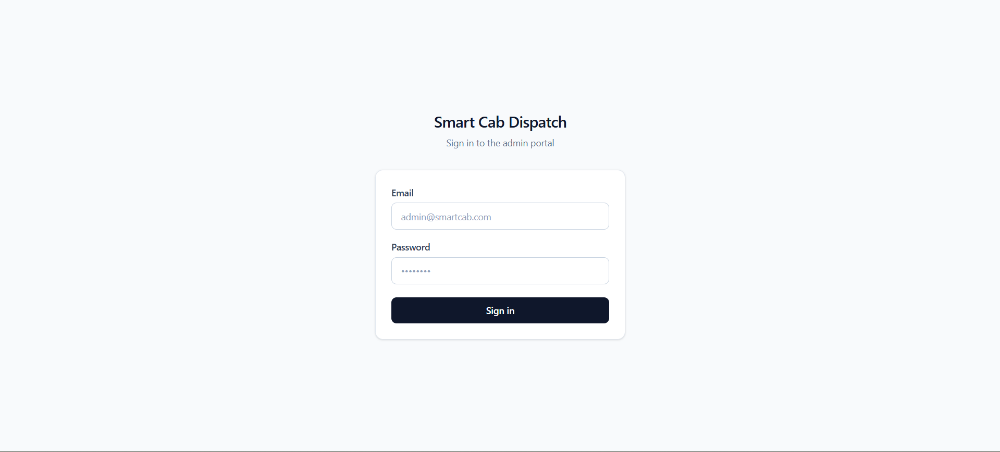
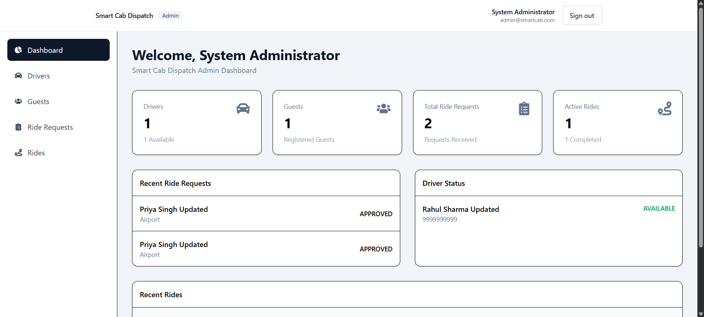
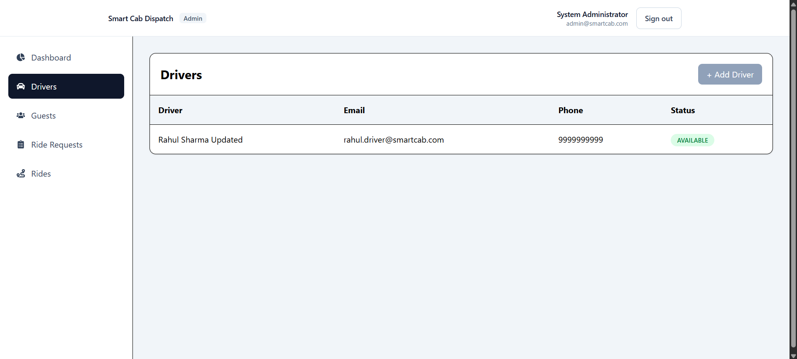
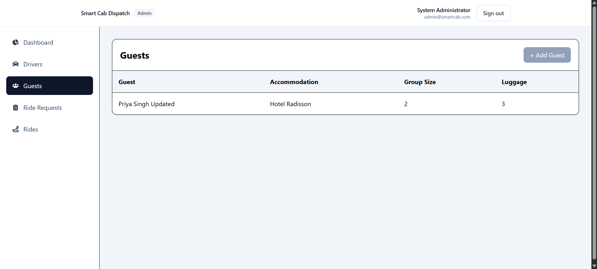
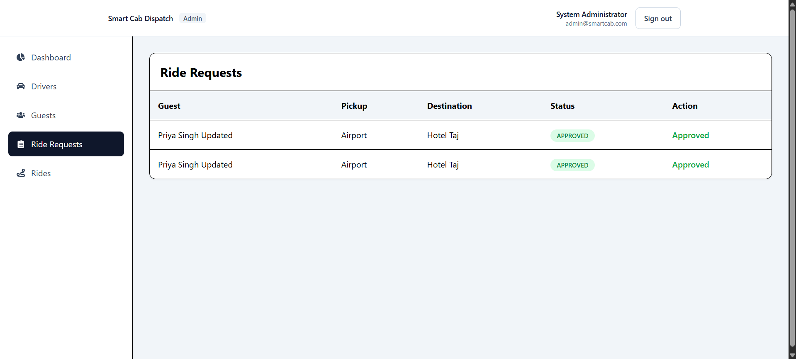
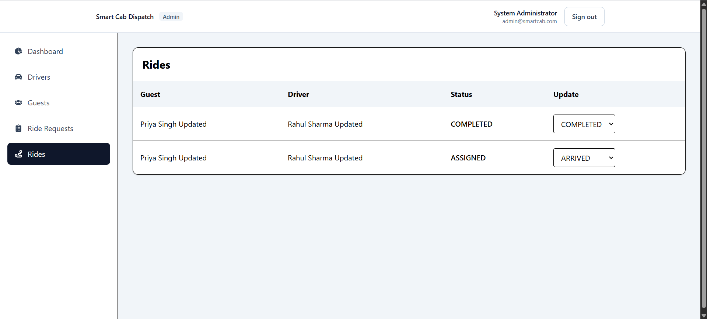

# 🚖 Smart Cab Dispatch System

<p align="center">

A production-inspired **Full Stack Cab Dispatch Management System** built using the **MERN Stack** for efficiently managing guest transportation across hotels, airports, conferences, and corporate events.

The application provides an end-to-end workflow from ride request creation to automatic dispatching and ride completion through a modern web-based administration portal.

</p>

---

## ✨ Features

### 🔐 Authentication & Authorization

- JWT Authentication
- Role-Based Access Control
- Protected Routes
- Persistent Login Sessions
- Secure Password Hashing (bcrypt)

---

### 👨‍✈️ Driver Management

- Create, Update & Delete Drivers
- Driver Availability Management
- Driver Status Tracking
- Vehicle Assignment
- Driver Lifecycle Management

---

### 👥 Guest Management

- Create, Update & Delete Guests
- Accommodation Management
- Pickup & Drop Information
- Group Size
- Luggage Capacity

---

### 🚘 Ride Request Workflow

Guests can request rides for:

- Airport Pickup
- Airport Drop
- Event Pickup
- Event Drop
- On-Demand Transportation

Workflow

```
Guest

↓

Ride Request

↓

Admin Approval

↓

Automatic Driver Assignment

↓

Ride Created
```

---

### 🚖 Automatic Dispatch Engine

Custom dispatch engine that automatically:

- Finds an available driver
- Validates driver availability
- Checks seat capacity
- Checks luggage capacity
- Assigns vehicle
- Creates Ride automatically

No manual driver assignment required.

---

### 🚦 Ride Lifecycle

Implemented complete ride lifecycle

```
PENDING

↓

ASSIGNED

↓

ARRIVED

↓

PICKED_UP

↓

COMPLETED

↓

Driver becomes AVAILABLE again
```

---

### 📊 Admin Dashboard

Modern responsive dashboard providing:

- Driver Statistics
- Guest Statistics
- Ride Statistics
- Ride Request Statistics
- Driver Status Overview
- Recent Ride Requests
- Recent Rides

---

### 🔄 Near Real-Time Updates

Implemented automatic **5-second polling** for:

- Dashboard Statistics
- Driver Status
- Ride Requests
- Ride Status
- Recent Activities

Provides near real-time synchronization between frontend and backend.

---

# 🖥️ Screenshots

## 🔐 Login

<p align="center">

</p>

---

## 📊 Dashboard

<p align="center">

</p>

---

## 👨‍✈️ Driver Management

<p align="center">

</p>

---

## 👥 Guest Management

<p align="center">

</p>

---

## 🚘 Ride Requests

<p align="center">

</p>

---

## 🚖 Ride Management

<p align="center">

</p>

---

# 🏗️ Architecture

```
smart-cab-dispatch
│
├── backend
│   ├── controllers
│   ├── middleware
│   ├── models
│   ├── routes
│   ├── services
│   ├── utils
│   └── config
│
├── admin-portal
│   ├── components
│   ├── contexts
│   ├── hooks
│   ├── layouts
│   ├── pages
│   ├── routes
│   ├── services
│   └── utils
│
└── guest-app
```

Backend follows a layered architecture

```
Routes
      ↓
Controllers
      ↓
Services
      ↓
Models
      ↓
MongoDB Atlas
```

---

# 🛠️ Tech Stack

### Frontend

- React
- React Router
- Axios
- Tailwind CSS
- Vite

### Backend

- Node.js
- Express.js
- MongoDB
- Mongoose
- JWT
- bcrypt

### Database

- MongoDB Atlas

---

# 📁 Core Modules

### Authentication

- Login
- JWT Authentication
- Authorization

### Driver Module

- CRUD APIs
- Driver Status
- Vehicle Assignment

### Guest Module

- CRUD APIs
- Pickup & Drop Details

### Ride Request Module

- Ride Creation
- Approval Workflow

### Dispatch Module

- Automatic Driver Matching
- Capacity Validation
- Vehicle Assignment

### Ride Module

- Ride Assignment
- Ride Lifecycle
- Ride Completion

---

# 🌐 REST APIs

## Authentication

```
POST   /api/auth/login
GET    /api/auth/me
```

---

## Drivers

```
GET
POST
PATCH
DELETE
```

---

## Guests

```
GET
POST
PATCH
DELETE
```

---

## Ride Requests

```
POST   /api/ride-requests
GET    /api/ride-requests
PATCH  /api/ride-requests/:id/approve
```

---

## Rides

```
GET    /api/rides
PATCH  /api/rides/:id/status
```

---

# 🚀 Getting Started

## Clone Repository

```bash
git clone https://github.com/GirishBishwanath/smart-cab-dispatch.git

cd smart-cab-dispatch
```

---

## Backend

```bash
cd backend

npm install

npm run dev
```

---

## Admin Portal

```bash
cd admin-portal

npm install

npm run dev
```

---

## Environment Variables

Backend

```
PORT=

MONGO_URI=

JWT_SECRET=
```

Frontend

```
VITE_API_URL=http://localhost:5000/api
```

---

# 🚀 Future Enhancements

- Socket.IO Real-Time Communication
- Live Driver Tracking
- Interactive Maps
- ETA Calculation
- Push Notifications
- Guest Portal
- Smart Driver Matching Algorithm
- Route Optimization
- Analytics Dashboard

---

# 📂 Project Highlights

- Layered Backend Architecture
- RESTful API Design
- JWT Authentication
- Automatic Dispatch Engine
- Ride Lifecycle Management
- Responsive Admin Dashboard
- Near Real-Time Updates
- MongoDB Atlas Integration
- Modular & Scalable Codebase

---

# 👨‍💻 Author

## Girish Bishwanath

**Full Stack Developer**

IIT Jodhpur

### GitHub

https://github.com/GirishBishwanath

### LinkedIn

https://www.linkedin.com/in/girishbishwanath/

---

<p align="center">

⭐ If you found this project useful, consider giving it a star!

</p>