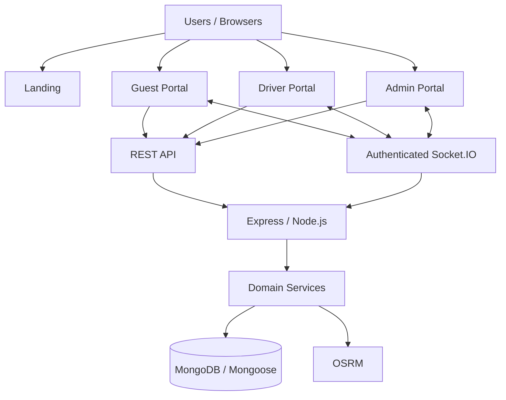

<div align="center">

# Smart Cab Dispatch

**A full-stack, real-time ride dispatch platform for guest, driver, and operations workflows.**

[](https://github.com/GirishBishwanath/smart-cab-dispatch/actions/workflows/ci.yml)
[](LICENCE)

[Live Landing](https://smart-cab-dispatch.vercel.app/) · [Guest Portal](https://smart-cab-dispatch-guest.vercel.app/) · [Driver Portal](https://smart-cab-dispatch-driver.vercel.app/) · [Admin Portal](https://smart-cab-dispatch-admin.vercel.app/) · [Backend](https://smart-cab-backend-jcfm.onrender.com/)

</div>

---

## Overview

Smart Cab Dispatch models a managed ride workflow from booking request to completed trip.

A guest submits pickup and destination details. An admin reviews the request. The dispatch service selects an eligible driver and vehicle using **availability, geographic proximity, passenger capacity, and luggage capacity**. The assigned driver receives the ride through authenticated Socket.IO, while authorized clients can follow ride state and live driver location.

The repository is a monorepo containing **one backend service and four independently deployable React applications**.

| Role | Responsibility |
| --- | --- |
| **Guest** | Sign up/login, request rides, follow active trips, view live route/ETA, and review history |
| **Driver** | Receive assignments, accept/decline rides, progress trips, share live location, and view history |
| **Admin** | Review requests, dispatch rides, manage guests/drivers, manage driver status, and monitor operations |
| **Public** | Product overview and portal entry points |

> **Portfolio state:** the application is feature-complete and intentionally frozen. This README describes the current implementation, not a future product roadmap.

## Live Applications

These URLs are documented by the repository's production deployment configuration.

| Application | Platform | Link |
| --- | --- | --- |
| Landing | Vercel | [Open](https://smart-cab-dispatch.vercel.app/) |
| Guest Portal | Vercel | [Open](https://smart-cab-dispatch-guest.vercel.app/) |
| Driver Portal | Vercel | [Open](https://smart-cab-dispatch-driver.vercel.app/) |
| Admin Portal | Vercel | [Open](https://smart-cab-dispatch-admin.vercel.app/) |
| Backend API | Render | [Open](https://smart-cab-backend-jcfm.onrender.com/) |
| Health | Render | [/health](https://smart-cab-backend-jcfm.onrender.com/health) |

Production deployment is provider-driven by Vercel and Render. GitHub Actions is the repository's CI quality gate; it does not deploy production.

---

## Product Flow

```text
Guest
  │
  ▼
Ride Request
  │
  │ admin approval
  ▼
Dispatch Service
  ├─ availability
  ├─ active ride / break filtering
  ├─ Haversine proximity ranking
  ├─ seat capacity
  └─ luggage capacity
  │
  ▼
Assigned Ride
  │
  ├──────── REST ──────────┐
  └──── authenticated ────┤
       Socket.IO           │
                           ▼
                 Guest / Driver / Admin
                    live ride state
                    + driver location
                    + route / ETA
```

---

## Product Preview

The repository contains the real product logo in each frontend, but **does not currently contain genuine application screenshots or a recorded demo**. No synthetic screenshots are included.

For a future portfolio screenshot set, capture real screens from the deployed applications and store them under `docs/assets/screenshots/`:

| Filename | Capture |
| --- | --- |
| `landing-page.png` | Landing page + dispatch visualization |
| `guest-booking.png` | Guest booking screen with map/location selection |
| `guest-live-ride.png` | Guest active ride with live map, route and ETA |
| `driver-current-ride.png` | Driver assigned/active ride |
| `admin-dashboard.png` | Admin operational dashboard |
| `admin-dispatch.png` | Admin request/dispatch workflow |

A genuine demo recording should show: **guest request → admin approval → driver assignment → driver accepts → driver location update → guest/admin live map update → ride completion**.

---

## Key Features

### Authentication & authorization

- Local email/password signup and login
- Google Sign-In verification through Google Identity Services
- JWT authentication for REST and Socket.IO handshakes
- Guest, Driver, and Admin RBAC
- bcrypt password hashing
- Minimum 8-character local password
- Protected frontend routes
- Password fields excluded from authenticated user responses

### Dispatch

- Map-based pickup and destination selection
- Separate `RideRequest` and `Ride` lifecycle
- Admin approval triggers dispatch
- Available-driver filtering
- Active ride/break exclusion
- Haversine distance ranking
- Passenger and luggage capacity matching
- Transactional driver reservation and ride creation
- Duplicate assignment protection

### Real-time operations

- Authenticated Socket.IO connections
- User-specific, driver-specific, and admin rooms
- Ride assignment/status events
- Driver availability/status events
- Live driver location updates
- Server-side driver/ride ownership validation
- Stale and future-dated location rejection
- Persist-before-broadcast location handling

### Maps & routing

- Leaflet / React-Leaflet
- OpenStreetMap tiles
- OSRM road-aware routing
- Backend routing service abstraction
- Route geometry, distance, duration, and ETA
- Live active-trip map updates

### Operations

- Guest management
- Driver management
- Vehicle management
- Ride-request approval/rejection/cancellation
- Ride lifecycle management
- Driver availability controls
- Guest/driver ride history
- Admin operational dashboard

---

## Architecture

The system is intentionally **one backend service + four independent frontend applications**.



### Backend structure

```text
backend/src/
├── config/          database, environment, Socket.IO
├── controllers/     HTTP transport layer
├── services/        business logic and integrations
├── models/          MongoDB/Mongoose models
├── routes/          REST API
├── middleware/      auth, RBAC, validation, errors, logging
├── dto/             response/data-transfer shaping
├── scripts/         operational scripts
└── utils/           shared backend utilities
```

Controllers handle transport concerns; services own business logic; models define persistence; middleware owns cross-cutting concerns.

### Core data model

- **User** — identity, role, authentication state
- **Guest** — guest profile linked to a User
- **Driver** — availability, location, current ride
- **Vehicle** — active vehicle and seat/luggage capacity
- **RideRequest** — requested trip before assignment
- **Ride** — assigned trip and lifecycle

See [Architecture](docs/Architecture.md) and [System Design](docs/SystemDesign.md) for the deeper design.

---

## Dispatch Algorithm

```text
Available drivers
      ↓
Exclude active rides / active breaks
      ↓
Rank by Haversine distance to pickup
      ↓
Check active vehicle
      ↓
Check seat + luggage capacity
      ↓
Revalidate inside MongoDB transaction
      ↓
Conditionally reserve driver
      ↓
Create Ride + attach driver
      ↓
Emit assignment/status events
```

Dispatch ranking intentionally uses geographic proximity rather than OSRM road distance. OSRM is used for the separate problem of road-aware route geometry, distance, and duration.

The current implementation loads available candidates into the Node.js process. The documented scale-up path is a MongoDB `2dsphere` query if fleet size materially increases.

---

## Ride Lifecycle

```text
Ride Request
  ├── PENDING
  │     ├── APPROVED → Ride created
  │     ├── REJECTED
  │     └── CANCELLED
  │
  └── Assigned Ride
        ├── ASSIGNED
        ├── ARRIVED
        ├── PICKED_UP
        ├── COMPLETED
        └── CANCELLED
```

Driver assignment and lifecycle mutations use transactions and conditional updates so durable assignment state remains authoritative in MongoDB.

---

## Real-time Architecture

```text
REST login
   ↓
JWT
   ↓
Socket.IO handshake
   ↓
Server verifies JWT + active user
   ↓
Authenticated socket identity
   ↓
User / Driver / Admin rooms
   ↓
Authorized realtime events
```

Driver location updates are validated against the authenticated driver, active ride ownership, coordinate validity, timestamp ordering, and trackable ride state before being persisted and broadcast.

See [Architecture](docs/Architecture.md) for the full room and event model.

---

## Technology Stack

| Area | Technology | Role |
| --- | --- | --- |
| Frontend | React 19 | Four role-focused web applications |
| Build | Vite | Development and production builds |
| Styling | Tailwind CSS v4 | UI styling |
| Routing | React Router | Client-side navigation |
| HTTP | Axios | REST communication |
| Backend | Node.js 22 / Express 5 | API and application server |
| Database | MongoDB / Mongoose 9 | Operational persistence |
| Realtime | Socket.IO 4 | Live communication |
| Auth | JWT / bcrypt | API/socket auth and password hashing |
| Google auth | Google Identity Services / google-auth-library | Server-side credential verification |
| Maps | Leaflet / React-Leaflet | Map UI |
| Map data | OpenStreetMap | Map tiles |
| Routing | OSRM | Road geometry, distance, duration |
| Testing | Vitest | Backend unit/integration tests |
| CI | GitHub Actions | Automated validation |
| Containers | Docker | Backend runtime/image validation |
| Hosting | Vercel + Render + MongoDB Atlas | Production hosting |

**Not current dependencies:** Redis, Kafka, Kubernetes, and microservices. They are documented only as possible future-scale options.

---

## Engineering Highlights

### Transaction-safe assignment

**Problem:** Concurrent approvals must not reserve the same driver.

**Implementation:** Driver and vehicle eligibility is revalidated inside a MongoDB transaction; the driver is conditionally reserved, the Ride is created, and the driver relationship is finalized atomically.

**Result:** MongoDB remains the source of truth for assignment state.

### Authenticated realtime location

**Problem:** A browser must not be able to publish arbitrary driver location.

**Implementation:** Socket.IO authenticates with the JWT; the server derives identity, verifies the active ride, validates timestamps/coordinates, persists the accepted location, and emits only to authorized rooms.

**Result:** Live tracking is tied to server-authorized identity and durable ride state.

### Routing behind a service boundary

**Problem:** The UI needs road-aware route geometry and ETA without owning provider-specific logic.

**Implementation:** The backend routing service calls OSRM and returns the geometry/metrics required by the Leaflet clients.

**Result:** Routing-provider coupling stays out of the frontend.

### Separate role-focused frontends

**Problem:** Guest, Driver, and Admin workflows have different navigation and permissions.

**Implementation:** Four independent Vite applications share the backend REST and realtime layers.

**Result:** Each portal can be built and deployed independently.

### Operational safeguards

The backend includes CORS allow-listing, security headers, disabled `X-Powered-By`, a 1 MB JSON body limit, structured request logging, `X-Request-ID` correlation, sensitive-field redaction, generic production errors, health/readiness endpoints, graceful shutdown, and OSRM failure handling.

---

## Repository Structure

```text
smart-cab-dispatch/
├── backend/          Express API, services, models, REST + Socket.IO
├── landing/          Public product website
├── guest-portal/     Guest booking and ride tracking
├── driver-portal/    Driver trip management and live location
├── admin-portal/     Dispatch and fleet operations
├── docs/             Architecture, API, deployment, Docker, system design
├── .github/workflows/ci.yml
├── LICENCE
└── README.md
```

---

## Getting Started

### Prerequisites

- Git
- Node.js 22 recommended
- npm
- MongoDB deployment supporting transactions
- Docker only for backend container usage

### Clone

```bash
git clone https://github.com/GirishBishwanath/smart-cab-dispatch.git
cd smart-cab-dispatch
```

### Backend

```bash
cd backend
npm ci
npm run dev
```

The backend defaults to port `5000`.

### Frontends

Run each application in its own terminal:

```bash
cd landing
npm ci
npm run dev
```

```bash
cd guest-portal
npm ci
npm run dev
```

```bash
cd driver-portal
npm ci
npm run dev
```

```bash
cd admin-portal
npm ci
npm run dev
```

Vite defaults to `5173`. The backend CORS configuration allows local ports `5173` through `5176`.

---

## Environment Variables

The repository does not commit environment-example files. The production variable reference is maintained in [docs/Deployment.md](docs/Deployment.md).

### Backend: `backend/.env`

```env
PORT=5000
MONGO_URI=<MongoDB connection string>
JWT_SECRET=<strong secret>
GOOGLE_CLIENT_ID=<Google OAuth client ID>
OSRM_BASE_URL=https://router.project-osrm.org
OSRM_ETA_FACTOR=1.4
ALLOWED_ORIGINS=http://localhost:5173,http://localhost:5174,http://localhost:5175,http://localhost:5176
```

### Landing

```env
VITE_GUEST_PORTAL_URL=http://localhost:5174
VITE_DRIVER_PORTAL_URL=http://localhost:5175
VITE_ADMIN_PORTAL_URL=http://localhost:5176
```

### Guest

```env
VITE_API_URL=http://localhost:5000/api
VITE_SOCKET_URL=http://localhost:5000
VITE_GOOGLE_CLIENT_ID=<Google OAuth client ID>
VITE_LANDING_URL=http://localhost:5173
```

### Driver / Admin

```env
VITE_API_URL=http://localhost:5000/api
VITE_SOCKET_URL=http://localhost:5000
VITE_LANDING_URL=http://localhost:5173
```

`GOOGLE_CLIENT_ID` is needed for Google Sign-In. Never commit real credentials.

---

## Testing

### Backend

```bash
cd backend
npm test
npm run test:integration
```

The integration suite uses a real MongoDB replica set for transaction/concurrency behavior.

### Frontends

Each frontend exposes `lint` and `build`:

```bash
cd landing && npm run lint && npm run build
cd ../guest-portal && npm run lint && npm run build
cd ../driver-portal && npm run lint && npm run build
cd ../admin-portal && npm run lint && npm run build
```

### CI

GitHub Actions runs for pull requests and pushes to `main`. It validates:

- `npm ci`
- frontend lint/build
- backend production dependency audit
- backend syntax
- backend unit tests
- MongoDB replica-set integration tests
- backend Docker image build

Workflow: [.github/workflows/ci.yml](.github/workflows/ci.yml)

---

## Docker

Only the **backend** is containerized.

```bash
docker build -t smart-cab-dispatch-backend ./backend

docker run --rm \
  -p 5000:5000 \
  --env-file backend/.env \
  smart-cab-dispatch-backend
```

The image uses Node.js 22, installs production dependencies, runs as the non-root `node` user, exposes `5000`, and has a healthcheck against `/health`.

Docker is a reproducible backend runtime and CI validation artifact. The current Render deployment remains native Node.js.

See [docs/Docker.md](docs/Docker.md).

---

## Deployment

```text
Four Vercel frontends
        │
        │ REST + Socket.IO
        ▼
Render backend
        │
        ├── MongoDB Atlas
        └── OSRM
```

The actual production flow is:

```text
Pull Request
    ↓
GitHub Actions CI
    ↓
Merge to main
    ↓
Vercel frontend deployment(s)
+
Render backend deployment
    ↓
Production smoke test
```

The GitHub Actions workflow is **CI**, not provider deployment automation. See [docs/Deployment.md](docs/Deployment.md) for the complete production configuration and smoke-test flow.

---

## Documentation

- [Architecture](docs/Architecture.md)
- [API Reference](docs/API.md)
- [Deployment](docs/Deployment.md)
- [Docker](docs/Docker.md)
- [System Design](docs/SystemDesign.md)

---

## Engineering Trade-offs

**MongoDB:** fits the current document-oriented operational model and provides the transaction semantics required by assignment.

**Socket.IO:** provides authenticated bidirectional communication for assignment, ride state, and live location while REST remains the durable-state API.

**Haversine:** provides a simple geographic ordering for driver candidates; OSRM is reserved for road-aware routing.

**OSRM:** supplies road geometry and duration behind a backend service boundary.

**Separate frontends:** keep Guest, Driver, and Admin permissions/navigation explicit and independently deployable.

**No Redis/Kafka/Kubernetes today:** the current single-backend architecture does not require their operational complexity. The system-design documentation records where they would become justified.

---

## Future Scale Direction

These are documented architectural options, not current dependencies:

- MongoDB `2dsphere` indexing for larger driver pools
- Socket.IO Redis adapter for multiple backend instances
- Background workers for expensive/retryable asynchronous work
- Centralized observability when operational requirements justify it
- Traffic-aware routing when OSRM no longer meets ETA requirements

---

## Contributing

This is primarily a portfolio project. Contributions can follow the normal pull-request flow:

1. Fork the repository.
2. Create a focused branch.
3. Make a small, coherent change.
4. Run relevant validation.
5. Open a pull request against `main`.

## License

MIT License. See [LICENCE](LICENCE).

---

<div align="center">

Built end-to-end by **Girish Bishwanath**

</div>
